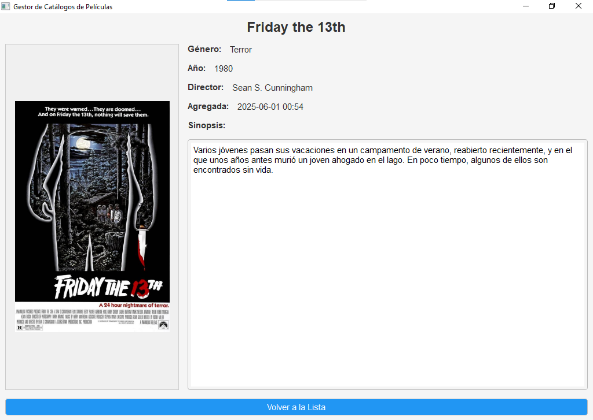

# Gestor de Catálogos de Películas



Aplicación de escritorio para gestionar catálogos de películas, desarrollada con Python y PyQt5.

## Características principales

- 🎬 Creación y gestión de múltiples catálogos de películas
- 📝 Agregar películas con información detallada (título, género, año, director, sinopsis)
- 🖼️ Soporte para imágenes de portada
- 🔍 Visualización completa de detalles de películas
- 🗑️ Eliminación de películas individuales o catálogos completos
- 💾 Persistencia de datos en formato JSON
- 📦 Almacenamiento organizado de imágenes

## Requisitos del sistema

- Python 3.7 o superior
- Bibliotecas: PyQt5, Pillow

## Instalación y ejecución

1. Clonar el repositorio:
   ```bash
   git clone https://github.com/tu-usuario/tu-repositorio.git
   cd tu-repositorio
    ```    
2. Crear y activar entorno virtual (recomendado):
   ```bash
    python -m venv venv
    # Windows:
    venv\Scripts\activate
    # Linux/Mac:
    source venv/bin/activate
    ```
3. Instalar dependencias:
   ```bash
   pip install -r requirements.txt
    ```    
4. Ejecutar la aplicación:
   ```bash
   python main.py
    ```  